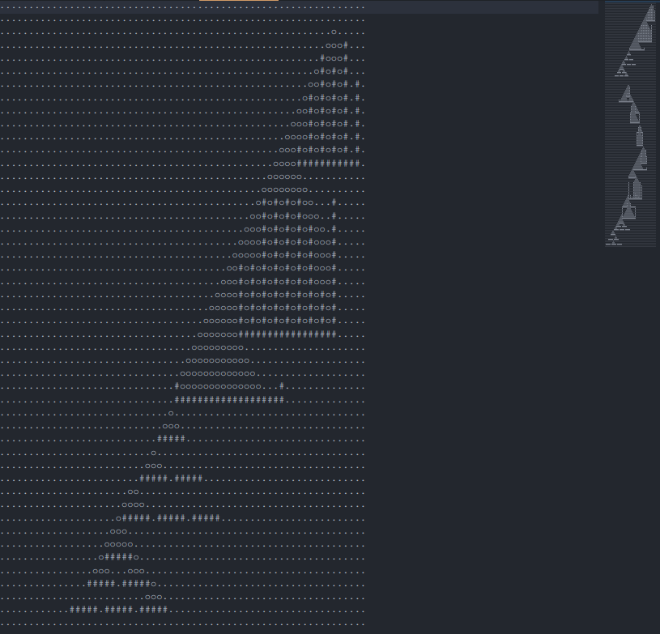

# Advent of Code 2022

<div align="center">
    
</div>


There is much for me to learn

## Day 1

Part 1:

- The problem is about simply reading the input and taking the sum of values
- We only need to find the maximum value, thus there is no need to store the calories each Elf carrying, just the current one and the maximum.
- What left is checking for blank line and EOF (end of file). For this, use `std::ifstream` and `string.empty()`

Part 2:

- For this part, simply extend a single maximum value to an array of 3 maximum values.
- If the current sum is greater than the minimum of the 3 values, we update the array.

---

## Day 2

Part 1:

- Assign values as follows:
  - Player 1: Rock (A) = 0, Paper (B) = 1, Scissor (C) = 2 (`P1 - 'A'`)
  - Player 2: Rock (X) = 2, Paper (Y) = 1, Scissor (Z) = 0 (`2 - (P2 - 'X')`)
- You will see that the result of a round can be identified from `(P1 + P2) MOD 3`
  - `(P1 + P2) MOD 3 == 1`: win
  - `(P1 + P2) MOD 3 == 2`: draw
  - `(P1 + P2) MOD 3 == 0`: lost

Part 2:

- The hand of player 2 can be identified by `(R - P1 + 3) MOD 3`
- Assign values as follows to have a slightly nicer result mod
  - Player 1: Rock (A) = 1, Paper (B) = 0, Scissor (C) = 2 (`(1 - (P1 - 'A')) MOD 3`)
  - Player 2: Rock (X) = 0, Paper (Y) = 1, Scissor (Z) = 2
  - `(P1 + P2) MOD 3 == 2`: win
  - `(P1 + P2) MOD 3 == 1`: draw
  - `(P1 + P2) MOD 3 == 0`: lost

---

## Day 3

Part 1:

- Simply keep an array of size 53 to check whether each alphabet char is present in each half string.
- If a char is present in both half string, add the _priority_ to the result
- Use `std::string_view` to reduce storage

Part 2:

- Basically similar to part 1, now with 3 strings.

---

## Day 4

Part 1:

- After reading the input, simply compare the range lower and upper bounds:
  - Range 1 contains range 2 if:
    $$lower\_bound_1 ≤ lower\_bound_2 \land upper\_bound_1 ≥ upper\_bound_2$$
  - Range 2 contains range 1 if:
    $$lower\_bound_1 ≥ lower\_bound_2 \land upper\_bound_1 ≤ upper\_bound_2$$

Part 2:

- There will be no overlap if either of the following happens
  - $lower\_bound_2 > upper\_bound_1$
  - $lower\_bound_1 > upper\_bound_2$

---

## Day 5

- Due to input format, reading the stack orders was a bit annoying.
- It's easier to specify the number of crate stacks in the beginning as a constant
- Reading the moving sequences and implementing it were rather simple with vector's `insert` and `erase`.
- Part 2 is similar to part 1, only minor changes is needed for `insert` and `erase` methods.

---

## Day 6

- Store the latest N characters in an array
- Have a function to check if all characters in that array is unique
  - Brute force comparison in $\mathcal{O}(N^2)$ would be fine, since there are only 4-p14 chars
  - Alternatively, we can create a $26 \times 1$ array to keep the presence of each alphabet char
- With that, keep reading characters and increment the count until all characters are unique.

---

## Day 7

Create the following `struct File` and `Dir` for `class FileTree`:

```cpp
using LL = long long;

struct File
{
    string name_;
    LL size_;
    File(const string &name, const LL &size)
    : name_(name), size_(size) {};
};

struct Dir
{
    string name_;
    LL size_;
    Dir* parent_;
    vector<Dir*> subdirs_;
    vector<File*> files_;

    Dir(const string &name, const LL &size, Dir* parent)
    : name_(name), size_(size), parent_(parent) {};

    void add_file(const string &name, const LL &s);
    void add_dir(const string &name);
    Dir* cd_subdir(const string &name);
};

class FileTree
{
private:
    Dir *root_;

public:
    FileTree() : root_(new Dir("/", 0, nullptr)) {};
};
```

We can iterate down each tree with a `static private` method taking in pointer `Dir*`, and a public method calling that on `root_`

For example, to add the size of files to a directory:

```cpp
void FileTree::propagate_size(Dir *dir) {
    LL size = 0;
    for (auto file : dir->files_) {
        size += file->size_;
    }
    for (auto subdir : dir->subdirs_) {
        propagate_size(subdir);
        size += subdir->size_;
    }
    dir->size_ = size;
}

void FileTree::propagate_size() {
    propagate_size(root_);
}

```

Part 1: Go down the tree and add the size of `dirs` to a variable `sum`

```cpp
void FileTree::sum_size(Dir *dir, LL &sum);

void FileTree::sum_size(LL &sum) const {
    sum_size(root_, sum);
}
```

Part 2: similarly, go down the tree searching for `dir` with size satisfying constraints

```cpp
void FileTree::search_dir(Dir *dir, LL &output, const LL &ref);

void FileTree::search_dir(LL &output, const LL &ref) {
    search_dir(root_, output, ref);
}
```

---

## Day 8

Part 1:

- Scan in each direction, check each tree one by one
- Compare the current height with the maximum height of checked trees, if the current height is greater, it's visible, else it's not visible.
- The final visibility is the OR of the visibility from 4 directions (though in implementation, simply assign value to one single 2D array)

Part 2:

- The view at each tree is independent with the view of its neighbors. Thus, must have a function to get the view from each position and check the _scenic score_ at every possible positions
- Though it's $\mathcal{O}(N^2)$, the map is small enough to go brute force like this.
- Possible speed up with multi-threading, but it's not a must.

---

## Day 9

A cool [visualization in reddit](https://www.reddit.com/r/adventofcode/comments/zgq3nr/2022_day_9_rope_pull/) =)

Part 1:

- The position of the head $x_{head}, y_{head}$ can be easily computed from the move commands
- If the position of the current tail is no longer "close" to the head, update it. The new position is always next to the position of the new head, on the opposite direction of the movement.
- Collect these positions into a trajectory. The movement pattern is rather simple, move diagonally one if needed, than basically just either horizontally or vertically.

Part 2: things are getting fun now

- The movement is much more complicated to just have a trajectory of few key points
- Instead, simulate the whole movement, one step at a time

---

## Day 10

- Store the signal strengths during each cycle in an array
- Not extremely hard, just be careful when setting values

---

## Day 11

- Reading the input was a bit tedious, but `stringstream` makes it easier
- After finishing the class `Monkey` with relevant methods, it's straight-forward.
- Simply iterate over the round, each over the monkeys and collect the result after their _"stuff-slinging simian shenanigans"_
- Part 2: As the relief no longer cases the worry level to be divided by 3, the worry level will keep increasing, and we will have to deal with very large number.
  - Notice that all the divisible checks have prime value. Thus, instead of keeping the large worry level, we could keep the modulus of it, by the product of all the prime numbers.

---

## Day 12

Part 1:

- Simple and clean with BFS (Breadth-first search)
- For ease and speed, get the map size first, so we can use arrays
  - Number of rows from counting lines with `getline(file, line)`
  - Number of columns from `line.size()`
- Have two arrays, one for the height map, one for the distance map
- Initialize the distance map: all values to `INT_MAX` (which is enough for test case and actual input), 0 for start point
- Keep a list of position to visit, initialize this list with the starting point
- As the `to_visit` list is not empty, check the first point
  - Check all neighbor points
  - If a neighbor point is unvisited and the elevation different is with in range, set the distance to be `+1` from the current point
  - Also append the above neighbor point to the end of `to_visit` list
  - After all 4 neighbor points are checked, remove the current point from the `to_visit` list

Part 2: only one minor change

- Simply initialize the `to_visit` list with all level-`a` points

---

## Day 13

TODO: Read [r/adventofcode](https://www.reddit.com/r/adventofcode/comments/zkmyh4/comment/j026ehh/)

---

## Day 14

It's certainly fun to watch the output grid



Part 1:

- Firstly, read the rock paths
- Set the range of the map according to the range of the paths
- There are two `while` loops
  - One for simulating one unit of sand falling
  - One for keeping the sand fall until stopping criteria, which, in this case, is that one sand block fall out of the required range.

Part 2: need few changes

- The range `xmin` and `xmax` is set using `ymax`
- Add the rock floor
- Add stopping criteria when the sand block is still at the falling point.

---

## Day 15

- Strategy for part 2 is better than in part 1.
- In the end, part 2 take `~1m20s` or `20s` if search backward :)
- Part 1:
  - After reading the input, find the range of the array to check
    - `xmin` = `xmin` of all sensors - its reach
    - `xmax` = `xmax` of all sensors + its reach
  - Define a `boolean` array, which we will check at each position, whether it's covered by a sensor
- Part 2:
  - The 2D map is huge, and we do not need to keep them in memory, thus, we should not keep an 2D array around.
  - We will check one line at a time, just like in part 1, and stop when we find a possible position
  - Checking and setting values one by one is okay for part 1, but is too slow for part 2.
  - A more elegant solution is to define a new `Interval` class/struct, to represent a range of value, e.g., interval 5-9 includes values 5, 6, 7, 8, 9.
  - Create helper functions to subtract `Interval`s
  - For each row:
    - The initial interval is 0-4.000.000
    - It's easier to find the interval under the scan of a sensor.
    - We subtract that from the initial interval
    - Repeat that for all sensors and all row
  - For most rows, in the end, we end up with no interval, implying no position is possible for the distress beacon on that row.
  - Stop the loop when after subtracting all sub-intervals, we still have an interval left.

---

## Day 18

Part 1:

- Define 3D coordinate and 3D gridmap

  ```cpp
  template<typename T>
  struct triplet
  {
      T x, y, z;
      triplet (const T &m1, const T &m2, const T &m3)
      : x(m1), y(m2), z(m3) {};
  };
  using Point = triplet<int>;

  enum BLOCK { LAVA, AIR };
  using Grid = vector<vector<vector<BLOCK>>>;
  ```

- For each `LAVA` cell, count how many of its 6 neighbors are `AIR` cells

Part 2:

- Add new type of block:

  ```cpp
  enum BLOCK { LAVA, AIR, STEAM };
  ```

- Fill the 3D gridmap with flood fill algorithm

  ```cpp
  void fill_steam(
      Grid &grid, const vector<int> &range, int x, int y, int z)
  {
      if (x < range[0] - 1 || x > range[1] + 1 ||
          y < range[2] - 1 || y > range[3] + 1 ||
          z < range[4] - 1 || z > range[5] + 1)
          return;
      BLOCK cell = grid[x - range[0] + 1][y - range[2] + 1][z - range[4] + 1];
      if (cell == LAVA || cell == STEAM)
          return;
      grid[x - range[0] + 1][y - range[2] + 1][z - range[4] + 1] = STEAM;
      fill_steam(grid, range, x - 1, y, z);
      fill_steam(grid, range, x + 1, y, z);
      fill_steam(grid, range, x, y - 1, z);
      fill_steam(grid, range, x, y + 1, z);
      fill_steam(grid, range, x, y, z - 1);
      fill_steam(grid, range, x, y, z + 1);
  }
  ```

- Then, just as in part 1, for each `LAVA` cell, count how many of its 6 neighbors are `STEAM` cells

---

## Day 20

- This is a problem for linked list.
- The running time also shows using `std::shared_ptr<Node>` is slower than using raw pointer `Node*`, but of course, it's safer (auto deletion).
- Define a circular bidirectional linked list as follows:

  ```cpp
  struct Node
  {
      int val_;
      Node *prev_, *next_;

      Node(const int &val)
      : val_(val), prev_(nullptr), next_(nullptr) {};
  };
  using LinkedList = vector<Node*>;
  ```

- The method `void move(LinkedList &A, const int &id)` is a bit complicate, but in the end, performs as expected.
- Other than that, everything was clean and straight-forward

---

## Day 21

- Not much to say, just a problem with binary tree.
- Each monkey is a node in the tree
- Define node and tree as follows:

```cpp
enum OP { ADD, SUB, MUL, DIV, EQU };

struct Node
{
    string name_;
    LL value_;
    OP op_;
    Node *child1_ = nullptr, *child2_ = nullptr;
};

class Tree
{
private:
    vector<Node*> nodes_;
    static void propagate_up(Node* node);
    static void propagate_down(Node* node);
public:
    Tree();
    ~Tree();
    void set_node();
    LL get_val();
};
```

---

## Day 22

- Part 2, folding the cube ... is ... insanely challenging. Many go with hard coding
- For part 1, I simply wrote 2 methods:
  - `get_next`: finds next possible position that is either ROCK or FREE space
  - `move`: rotates and moves forward step by step

```cpp
void get_next(const int &x, const int &y, int &x_next, int &y_next);

auto move = [&](char dir, int step)
{
    rotate(dir);
    int x_next = 0, y_next = 0;
    for (int s = 0; s < step; s++) {
        get_next(x, y, x_next, y_next);
        if (grid[y_next][x_next] == ROCK)
            break;
        x = x_next;
        y = y_next;
    }
};
```

---

## Day 23

- Basic data structure idea for direction and elves:

```cpp
enum Direction : int { NORTH = 0, SOUTH = 1, WEST = 2, EAST = 3 };

struct Coord
{
    int x_, y_;
};
Coord operator+(const Coord &p1, const Coord &p2);
Coord operator-(const Coord &p1, const Coord &p2);
bool operator==(const Coord &p1, const Coord &p2);

struct Elf
{
    Coord position_, next_position_;
    Direction direction_;
};

bool grid_map[3 * RANGE][3 * RANGE];
```

- Insight about elves plan to go into same position:\
  For each stacking position, there will be only 2 elves, and they are in the opposite sides of the stacking position. In other words, the elves will only plan to go to the same position in pair.\
  There are only 2 possible scenarios as follows:

```txt
# Case 1: 1 elf going right, 1 elf going left
...       ...
#.#   --> .#.
...       ...

# Case 2: 1 elf going down, 1 elf going up
.#.       ...
...   --> .#.
.#.       ...
```

- We can still simply compare all pair of elves, if they have the same `next_position`, set it back to their `current_position`. But this will take $\mathcal{O}(N^2)$ with $N$ as the number of elves\
  Following this strategy, part 1 took around `130ms`, part 2 took `~18s` for nearly 1000 steps
- Alternatively, we can just let each of them move if it's possible.
  - If an elf want to move to an occupied position, it will not only stay still, but also push the elf in the stacking position back as well.
  - To search for the previous elf, we go back from the ID of the current elf to 0.
  - Due to the way we read the input line by line, we just have to check around `100-200` previous elves
  - With this strategy, we reduce run time to `10ms` for part 1, and `400ms` for part 2.

---

## Day 24

- High level idea
  - Simulate the movement of blizzards
  - For each time step, keep a grid map of reachable positions
  - At the beginning, the only reachable position is the starting point
  - At any time step, reachable positions are those in neighbor of previous reachable positions.
  - It could include the previous reachable positions themselves, if possible
- A bit tedious writing all the helper functions, but overall, it is not too complicated.
- Part 2 is simply extension from 1 trip to 3 trips.

---

## Day 25

- I don't really get it :(
- Just implement a solution from [r/adventofcode](https://www.reddit.com/r/adventofcode/comments/zur1an/2022_day_25_solutions/)
