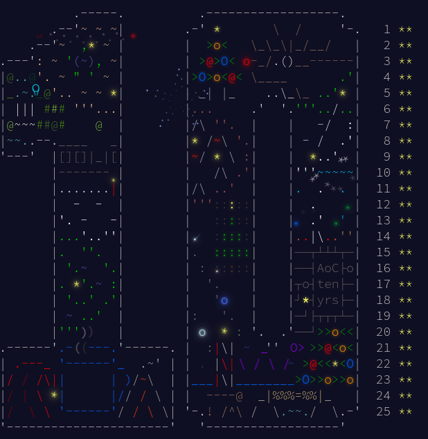

# Advent of Code

    

## Day 18

- Use BFS for part 1.
- Use binary search for part 2. I did it manually such that I don't have to write simulation code

## Day 17

- In part 2, hard-code the inversion, not so nice, but it works
- Not much to say for part 1, just implement all operations

## Day 16

- Still using breadth-first search
- In part 2, kind of back-tracking the path from the end point.

## Day 15

- The simulation for part 2 was a bit tricky
- Maintain a set of space in the map that will be moved or be moved in to.
- That set has to contain the spaces of all objects, two spaces for each object, and also the spaces the objects will move into
- Extend this set when the space moved into include another object.

## Day 14

- Part 1 involves just with coordinate calculation and using modulo
- Part 2 is fun `:))`. Did a bit of binary search to find a shorter range: 6500 - 7000
- Then literally checking through each outputs

## Day 13

- Finding integer solutions for system of 2 linear equations
- There are 3 possible cases depending on the weights
  - No solution
  - One unique solution
  - Infinite no. solutions
- It's easy to deal with the 2 first cases
- For the infinite case, use brute force to find valid integer solution with minimum cost

## Day 12

- Use flood fill algorithm.
- For the second part, combine segments of the perimeter.
- The combining function was a bit tricky with edge cases
  - Can not combine if the segments are in different direction
  - Can not combine if the segments are not in neighbor
  - Can not combine if there are certain changes in label
    - This is not combinable: `[XA;BX]`
    - But this is combinable: `[XA;XB]`, `[XX;AB]`

## Day 11

- Dynamic programming with memoization
- Have a map to store the score for input value v after n blinks
- The score for `(v, n)`, if not already known, is equal to the sum of the score from transformed values with n-1 blinks.

## Day 10

- Basically breadth first search

## Day 9

- For part 1, use two-pointer method
- For part 2, setup two arrays including the size and starting indices of free spaces and files.

## Day 8

- Simple math operations for 2D poses.

## Day 7

- Maintain a set to store temporary values
- Iterate over all value in the array: Temporary values are all possible values from doing all possible operations between all previous temporary values with the current value

## Day 6

- Put obstacles on all visited positions in part 1.
- Pure brute force on all possible obstacle positions
- Detect the loop when a position is already visited, the same position with the same moving direction.
  - Use a 3D `boolean` array. The first two dimensions correspond to the dimension of the map

## Day 5

- Not much to say, for each update, iterate over all rules
  - Skip irrelevant rules, in which both components are not present
- For part 2, save the list of related rules, in which both components are present
  - Sort the array with insertion sort by swapping element

## Day 4

It's so easy that I don't know what to write here. Just a bunch of if-else statements are enough `:))`

## Day 3

- Finally learn how to use `regex`
- The `don't` flag doesn't reset by the end of each line, which sucks by the way.
- Simply put everything in a single line to avoid coming up with another solution

## Day 2

- Instead of going with overly complicate if-else conditions, just brute force the heck out of it.

## Day 1

- Simple operation on 2 arrays, simply sort them first
- For the second half, use two pointers method. Not sure if needed, but surely a bit faster.
