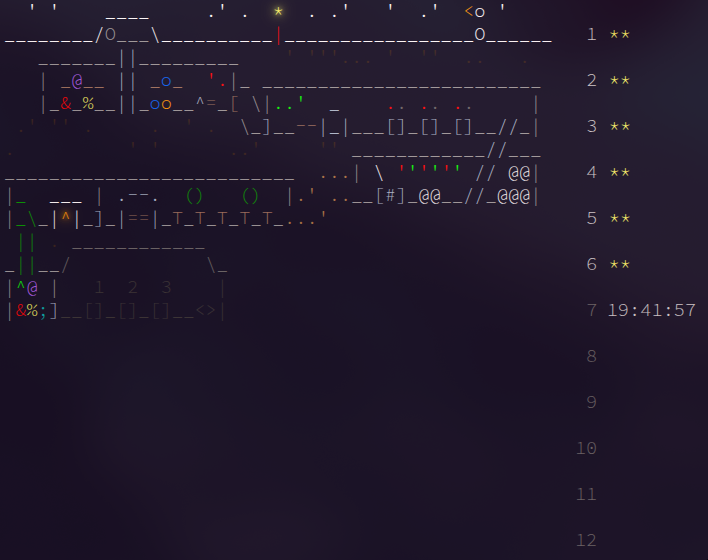

# Advent of Code

    

## Day 6

- Part 1: use `stringstream` to parse the input to either a 2D array or vector
- Part 2:
  - Need to use a 2D array of char to store the raw input
  - Use two pointers to parse the input from right to left: the left pointer is the column index of the math operator, either '+' or '\*', the right pointer is the previous left pointer shifting to the left.

## Day 5

- Use a set to store unique ranges
- Try to combine all pairs of ranges until nothing is possible

## Day 4

- For part 2, have a do-while loop, the loop continue if there is at least one roll removed

## Day 3

- Simply search for the largest digit in a suitable range: after the previous digit while still leaving enough digits for the rest

## Day 2

- Convert to string and check if the chars are the same in the sub-strings

## Day 1

- Part 1: use mod operator. If the dial position ends up at 0, increment the point.
- Part 2: take the modulo of the shift with 100. If the dial go over 100 or below 0, increment the point
